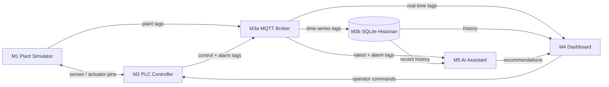

# Smart Beverage Pasteurization & Bottling Line — Digital Twin

**TUMA206 Group 1**

Canonical repository: **[linchensi/TUMA206-digital-twin-V5](https://github.com/linchensi/TUMA206-digital-twin-V5)**

A complete industrial digital twin of a beverage pasteurization and bottling line, built as a pure-Python implementation of the Purdue enterprise reference architecture across five ISA-95 layers: physical process simulation → PLC control → MQTT data transport → operator dashboard → AI-assisted diagnostics. Every module has explicit input/output pins, a single responsibility, and a documented port specification.

---

## Deployment & Demo Guide

### Quick Launch (Windows — double-click `START_ALL.bat`)

| File | Effect |
|------|--------|
| **`START_ALL.bat`** | Starts one local backend and the MQTT-connected HMI at `http://localhost:8501`, then opens both the local HMI and Community Cloud monitor |
| `launchers/1_start_local.bat` | Starts only the plant/backend publisher |
| `launchers/2_start_dashboard.bat` | Starts only the MQTT-connected HMI at `http://localhost:8501`; the backend must already be running |
| `launchers/3_start_cloud.bat` | Opens the [Community Cloud monitor](https://dashboard-beverage-digital-twin.streamlit.app/) |

> [!CAUTION]
> Run **exactly one `local_backend.py` per `MQTT_TOPIC_PREFIX`**. Multiple backends publish different simulations to the same topic, causing tick values and alarms to flicker between states. Close old backend terminals before running `START_ALL.bat` again.

### Runtime Modes

| Mode | Entry point | Engine | Controls | MQTT |
|------|-------------|--------|----------|------|
| **Quick launch / local HMI** | `START_ALL.bat` → `http://localhost:8501` | `local_backend.py` runs the plant; HMI uses `RemoteEngineProxy` | Full controls, sent as MQTT commands | Yes |
| **Standalone local demo** | `python -m streamlit run dashboard/app.py` | `SimulationEngine` runs inside Streamlit | Full direct controls | No, unless `USE_MQTT=1` |
| **Cloud Monitor** | [beverage-digital-twin.streamlit.app](https://dashboard-beverage-digital-twin.streamlit.app/) | No simulation; read-only MQTT subscriber | None | Yes |
| **Full Demo** | [tuma206mdi-beverage-digital-system.streamlit.app](https://tuma206mdi-beverage-digital-system.streamlit.app/) | Self-contained `SimulationEngine` | Full direct controls | No |

> **Important:** The **Cloud Monitor** shows data ONLY when a local backend is running and publishing to the SAME MQTT broker. It does not run its own simulation. The **Full Demo** URL is a standalone showcase that runs its own engine — it does NOT connect to your local backend or upload data to the cloud monitor.

### How the Cloud Monitor Works

```
Your PC                                   HiveMQ Cloud              Streamlit Cloud
┌──────────────────┐                    ┌────────────┐            ┌──────────────────┐
│ local_backend.py │  ──publish──>      │ MQTT       │  ──sub──> │ cloud_app.py     │
│ (engine + MQTT)  │                    │ Broker     │            │ (read-only KPI)  │
└──────────────────┘                    └────────────┘            └──────────────────┘
```

1. The local `.env` file supplies the broker credentials.
2. One `local_backend.py` publishes a tag snapshot every second on `{prefix}/tags` and listens for HMI commands on `{prefix}/cmd`.
3. The local MQTT HMI and Community Cloud monitor subscribe to the same tag topic.
4. Closing the backend stops live updates; starting exactly one backend resumes them.

### MQTT Configuration

Create `.env` locally using dotenv syntax:

```dotenv
MQTT_HOST=<your-cluster>.s1.eu.hivemq.cloud
MQTT_PORT=8883
MQTT_TLS=1
MQTT_USERNAME=<your-username>
MQTT_PASSWORD=<your-password>
MQTT_TOPIC_PREFIX=<unique-topic-prefix>
```

For Streamlit Community Cloud, open **App settings → Secrets** and use TOML syntax (strings require quotes):

```toml
MQTT_HOST = "<your-cluster>.s1.eu.hivemq.cloud"
MQTT_PORT = "8883"
MQTT_TLS = "1"
MQTT_USERNAME = "<your-username>"
MQTT_PASSWORD = "<your-password>"
MQTT_TOPIC_PREFIX = "<unique-topic-prefix>"
```

The local backend and every remote dashboard must use identical MQTT settings. `.env` and `.streamlit/secrets.toml` are ignored by Git; never commit real broker, Telegram, or API credentials. Save and reboot the Community Cloud app after changing Secrets.

### Troubleshooting

| Symptom | Likely cause | Fix |
|---------|--------------|-----|
| Alarm appears and clears every few seconds; tick jumps backward/forward | Multiple backends publish to the same topic prefix | Close every old backend process, then run `START_ALL.bat` once |
| Cloud monitor shows **No data** | Backend stopped, MQTT values differ, or topic prefix differs | Start one backend and compare all six MQTT settings on both sides |
| `http://localhost:8501` does not open | Dashboard is still starting or port 8501 is occupied | Wait a few seconds; close old dashboard terminals before retrying |
| Community Cloud is slow on its first visit | The free app is waking from sleep | Wait for the cold start; normal live refresh is approximately 1–3 seconds |
| Cloud code or Secrets changed but old behaviour remains | Community Cloud hot reload retained old process state | Save settings and use **Reboot app** once |

### Telegram Alarm Notifications (Optional)

The local backend pushes a Telegram message when any alarm fires — runs on the **local machine** (where the engine lives), in a background thread that never blocks the control loop.

**Setup:**
1. Message **@BotFather** on Telegram → `/newbot` → copy the bot token
2. Add the bot to your group, then open `https://api.telegram.org/bot<TOKEN>/getUpdates` → copy the chat ID
3. Add to `.env`:
```bash
TELEGRAM_BOT_TOKEN=123456789:AA...
TELEGRAM_CHAT_ID=-1001234567890
```

When set, `local_backend.py` prints `Telegram alarms: on` and sends a "backend online" message at startup. On every new alarm, the bot posts `[ALARM] <code> — <description> | Pasteur: <temp>°C | Tank: <level>%`. If the variables are missing, it stays silently off.

### Local Installation

Prerequisites: Windows 10/11, Python 3.10 or newer, Git, and internet access when using HiveMQ Cloud or the hosted dashboard.

```bash
git clone https://github.com/linchensi/TUMA206-digital-twin-V5.git
cd TUMA206-digital-twin
python -m venv .venv
.venv\Scripts\activate
pip install -r requirements.txt
python -m streamlit run dashboard/app.py --server.port 8501
```

The command above is the self-contained local demo. For the distributed MQTT demonstration, configure `.env` and use `START_ALL.bat` instead.

### Smoke Test

```bash
python scripts/run.py --ticks 30
```

---

## Table of Contents

1. [System Architecture](#system-architecture)
2. [Module Specification](#module-specification)
3. [Process Pipeline](#process-pipeline)
4. [Control Strategies](#control-strategies)
5. [Sequential Startup](#sequential-startup)
6. [Thermal Physics](#thermal-physics)
7. [Fault Injection & Alarm System](#fault-injection--alarm-system)
8. [Dashboard](#dashboard)
9. [Cloud Monitoring Dashboard](#cloud-monitoring-dashboard)
10. [Repository Structure](#repository-structure)
11. [Key Configuration](#key-configuration)
12. [Technology Stack](#technology-stack)

---

## System Architecture

The system follows the **Purdue Enterprise Reference Architecture** (PERA), adapted for a single-line beverage process:

```
ISA-95 Layer 4 (Enterprise)     M5 AI Assistant        —— diagnosis + operator recommendations
ISA-95 Layer 3 (Manufacturing)   M4 Dashboard           —— HMI: P&ID, trends, alarms, fault injection
ISA-95 Layer 2 (Control)         M3 Data Layer          —— MQTT pub/sub + SQLite historian
ISA-95 Layer 1 (Sensors)         M2 PLC Controller      —— state machine + PI control + fault detection
ISA-95 Layer 0 (Process)         M1 Plant Simulator     —— physics: thermal, flow, bottling
```



**Key architectural rule:** the closed-loop control path exists **only** between M1 (Plant) and M2 (PLC). M5 (AI) recommends operator actions but never directly controls actuators. M4 injects faults and applies manual overrides through M2 — never bypasses it.

The system advances one **tick** per simulated second. Each tick: M1 publishes sensor values → M2 reads them, runs control logic, outputs actuator commands → M1 applies commands → M3 publishes the combined tag snapshot and persists it to SQLite.

---

## Module Specification

### M1 — Plant Simulator (`simulator/plant.py`)

A physics-only model. Receives actuator commands and fault-injection codes; produces sensor readings. Contains **no control logic**.

```
module M1_PlantSimulator (
    input  pump_cmd, inlet_valve_cmd, heater_power_cmd,
    input  cooling_valve_cmd, conveyor_cmd, fill_valve_cmd, capper_cmd,
    input  fault_inject_code, reset_fault,
    output tank_level, pasteur_temp, cooler_temp, flow_rate,
    output bottle_count, bottles_completed, conveyor_queue,
    output pump_feedback, valve_feedback,
    output fill_phase, fill_progress, nozzle_status[4], fault_status
)
```

| Subsystem | Model | Key Parameters |
|-----------|-------|---------------|
| Raw Tank | Mass balance: `inflow(6.0×valve%) − outflow(4.0×pump%)` tank-%/tick | Starts empty, fills on START |
| Feed Pump | `flow_rate = 40.0 × pump%` ± noise | 0–40 L/min |
| Pasteurizer | Heating (τ≈12s) + flow-through cooling + noise | Target = 25°C + heater%×65°C (max 90°C) |
| Cooler | Pipe transit (inlet ~53°C) + active glycol HX (floor 15°C) | AUTO valve ~43% at 25°C |
| Filler | 4-nozzle inline monoblock: INDEX(gap 1–3t) → FILL → discharge | 500 mL/bottle, 4 per carrier |
| Conveyor | Continuous float buffer: `min(buf, 1.5×conv%/100)` bottles/tick | Capacity 60, target 12 |

### M2 — PLC Controller (`plc/controller.py`)

Scan-cycle PLC emulation. State machine, PI/P loops, 8-alarm fault detection every tick. Safety interlocks are **never bypassed**.

```
module M2_PLCController (
    input  tank_level, pasteur_temp, cooler_temp, flow_rate,
    input  bottle_present, pump_feedback, valve_feedback,
    input  operator_start, operator_stop, manual_overrides,
    output pump_cmd, inlet_valve_cmd, heater_power_cmd,
    output cooling_valve_cmd, conveyor_cmd, fill_valve_cmd, capper_cmd,
    output alarm_code, plc_state, startup_phase
)
```

**State Machine:**

```
IDLE ──[START]──> STARTING(HEAT) ──[temp+level OK]──> STARTING(PRIME) ──[flow>5]──> RUNNING
  ^                    ^                                     |                          |
  |                    |                                     v                          |
  |                    └─────────────── [serious alarm] ─── FAULT ───[acknowledge]─────┘
  └───[STOP]──────────────────────────────────────── STOPPING ──[1t]── IDLE
```

| Stage | Method | Detail |
|-------|--------|--------|
| S1 Inlet Valve | Feed-forward + P trim | FF = `pump%×67%`. Trim = `−3.0×level_error`. Cascade with pump. |
| S1 Feed Pump | Proportional + smoothing | 30–100% proportional to tank level; smoothing 0.4 |
| S2 Pasteurizer | PI + anti-windup + adaptive gain | SP 72°C, gain 1.5–5.0 flow-adaptive, true anti-windup |
| S3 Cooler | PI + anti-windup | SP 25°C, gain 2.5 |
| S4 Filler | Interlock + back-pressure | Opens when pasteurized(≥68°C), cooled(≤28°C), flow>1, buffer<95% |
| S5 Conveyor | P-controller on buffer | `cmd = clamp(40+6×(buffer−12), 20, 100)` |

### M3 — Data Layer

- **M3a Message Bus** (`messaging/bus.py`): `InProcessBus` (zero-config) / `MqttBus` (paho-mqtt with TLS auth for HiveMQ Cloud). Topic: `{prefix}/tags` (snapshots up), `{prefix}/cmd` (commands down).
- **M3b Historian** (`historian/store.py`): SQLite time-series with auto-schema. CSV export. 300s default window.

### M4 — Dashboard

The multi-page HMI supports two engine modes via `dashboard/shared.py`; the separate cloud entry point is always read-only:

| Dashboard | Entry Point | Engine | Control |
|-----------|-------------|--------|---------|
| **Standalone local** | `dashboard/app.py` with default `DASHBOARD_MODE=local` | In-process `SimulationEngine` | Full direct control |
| **MQTT local HMI** | `dashboard/app.py` with `DASHBOARD_MODE=remote` | `RemoteEngineProxy`; plant runs in `local_backend.py` | Full controls published on `{prefix}/cmd` |
| **Cloud Monitor** | `cloud_app.py` on Community Cloud | `RemoteEngineProxy`; tag subscription only in the rendered UI | Read-only monitoring |

| Page | Content |
|------|---------|
| **SCHEMATIC** | SVG industrial P&ID (7 animated equipment nodes), stage cards (S1–S5), KPI summary, manual override, fault injection, START/STOP/HARD RESET |
| **TRENDS** | 2×2 sensor charts (Pasteur Temp + safe band, Tank Level, Flow Rate, Bottles) + actuator charts (Heater, Cooler dual-axis). FREEZE/UNFREEZE per chart. IDLE filtered. |
| **ALARMS** | Auto-diagnosis panel, Force Analysis (alarm or health check), AI consultation chat with 4 quick-action buttons, free-form input outside auto-refresh fragment, alarm log, API key hot-swap |

### M5 — AI Assistant (`ai_assistant/assistant.py`)

Dual-provider LLM support with rule-based fallback:

- **OpenAI / Anthropic** — auto-detected by API key prefix (`sk-proj-…` or `sk-ant-…`). Sends live tags + alarm + trend history. Returns concise operator-facing diagnosis. **Never commands actuators.**
- **Rule-based fallback** — analyses live sensor data for all 8 alarm types. Produces structured response: state summary, alarm advice, out-of-range warnings.

---

## Process Pipeline

```
[Inlet Valve] → [S1 Raw Tank] → [Feed Pump] → [S2 Pasteurizer] → [S3 Cooler] → [S4 Filler ×4] → [S5 Conveyor/Capper] → Output
```

| Stage | Function | Key Variables | Setpoints / Limits |
|-------|----------|---------------|-------------------|
| S1 | Raw beverage buffering | Level 0–100% | Target 55%, range 30–80%, alarm 15–90% |
| S2 | Pasteurization (thermal kill step) | Temp ambient–90°C | SP 72°C, safe 68–78°C |
| S3 | Cool to bottling temp via glycol HX | Temp 15–55°C | SP 25°C, limit 28°C, alarm 32°C |
| S4 | Fill 4 bottles/carrier in lockstep | Flow, progress, nozzle×4 | 500 mL/bottle |
| S5 | Buffer → capper → output | Buffer 0–60 | P-ctrl target 12, alarm ≥54 |

---

## Control Strategies

### S1 — Tank Level Feed-Forward Cascade

Two actuators, one variable. The pump is master (sets rate), the inlet is slave (matches consumption). FF = `pump% × (4.0/6.0) × 100` + P-trim `±3.0×level_error`. Result: stable at 55.0% ±2%, no oscillation.

### S2 — Pasteurizer PI with Adaptive Gain

Flow-adaptive gain compensates variable cooling load: >35 L/min→5.0, 20–35→3.0, 8–20→2.0, <8→1.5. True anti-windup blocks integration only when saturated AND error pushes deeper.

### S3 — Cooler PI with Pipe Transit

Product cools passively in inter-stage pipe (≈40% ΔT shed). HX inlet at 50–55°C. PI (gain 2.5) drives glycol valve. Manual authority: 0%→53°C, 10%→40°C alarm, AUTO ≈43%→25°C, 80%→22°C.

### S4 — Filler Interlock + Flow-Driven Timing

Hard interlocks: product must be pasteurized (≥68°C) AND cooled (≤28°C). INDEX gap dynamic: `max(1, min(3, 8.0/flow))` ticks. Fill progress = `flow×dt / 2000mL`.

### S5 — Conveyor Buffer P-Controller

Autonomous: `cmd = clamp(40 + 6×(buffer−12), 20, 100)`. Buffer grows → belt speeds up. Self-regulating.

---

## Sequential Startup

Three phases prevent cold product from reaching the filler:

| Phase | PLC | Inlet | Heater | Pump | Filler | Conveyor | Transition |
|-------|-----|-------|--------|------|--------|----------|------------|
| **HEAT** (0) | STARTING | AUTO (fill tank) | **100%** | OFF | OFF | OFF | temp≥68°C, cooler≤28°C, tank≥30% |
| **PRIME** (1) | STARTING | AUTO (FF+P) | AUTO (PI) | 0→40% ramp | OFF | OFF | flow>5 L/min for 3 consecutive ticks |
| **RUNNING** (2) | RUNNING | AUTO (FF+P) | AUTO (PI) | AUTO (P) | AUTO | AUTO (P-ctrl) | — |

Tank alarms suppressed during HEAT. Manual override bypasses sequencer only for that actuator.

---

## Thermal Physics

### Pasteurizer

1. **Heating** — `temp += 0.08 × (target − temp)`, target = `25°C + heater% × 65°C`, τ≈12s
2. **Flow-through cooling** — `temp −= 0.012 × flow_factor × (temp − 25°C)`
3. **Noise** — ±0.04°C

Steady state: ~84% heater → 72°C at normal flow.

### Cooler

1. **Pipe transit** — `pipe_temp = 72°C − 0.50×(1−0.3×flow)×(72−25°C)` → inlet ~53°C
2. **Inlet heating** — `temp += 0.08 × flow_factor × (pipe_temp − temp)`
3. **Active glycol** — `temp += 0.30 × valve% × (15°C − temp)`

| Valve | Temp | State |
|-------|------|-------|
| 0% | ~53°C | No cooling |
| 10% | ~40°C | COOLER_HIGH alarm |
| 43% (AUTO) | **25°C** | PI setpoint |
| 80–100% | ~22°C | Maximum cooling |

---

## Fault Injection & Alarm System

Four injected faults, one per ISA-95 layer, detected ≤60s:

| Code | Layer | Fault | Alarm | Detection | Auto-clear |
|------|-------|-------|-------|-----------|------------|
| 1 | L1 Sensor | Temp sensor frozen | SENSOR_TEMP_STUCK (10) | ~3s, dual-mode | No |
| 2 | L2 Equipment | Feed pump failure | PUMP_NO_FLOW (20) | ~3s | No |
| 3 | L3 Process | Heater runaway | TEMP_OUT_OF_RANGE (30) | ~11s, target 98°C | **Yes** |
| 4 | L4 Infrastructure | MQTT broker dead | DATA_STALE (40) | Instant | No |

Process alarms (triggered by conditions, not injected):

| Code | Alarm | Trigger | Auto-clear |
|------|-------|---------|------------|
| 50 | TANK_OVERFLOW | Level ≥90% (pump-active) | No |
| 51 | TANK_EMPTY | Level ≤15% (pump-active) | No |
| 52 | BUFFER_HIGH | Buffer ≥54/60 | No |
| 53 | COOLER_HIGH | Cooler ≥32°C | **Yes** (<32°C) |

**Priority:** DATA_STALE > TANK_OVERFLOW > TANK_EMPTY > BUFFER_HIGH > COOLER_HIGH > TEMP_OUT_OF_RANGE > PUMP_NO_FLOW > SENSOR_TEMP_STUCK. All use 3-tick debounce.

---

## Dashboard

### Page 0 — SCHEMATIC

- **SVG P&ID**: 7 animated equipment nodes with status glow, pump impeller spin, pipe flow dash, heat pulse, fill streams, belt bottle movement. Manual override "M" badges.
- **Status banner**: Context-aware (WARMING UP / PRIMING PUMP / NORMAL / ALARM).
- **Stage cards** (S1–S5) + **KPI cards** (6 metrics).
- **Sidebar**: START / STOP / HARD RESET, per-actuator manual override (checkbox→slider from current AUTO value→smooth return), fault injection (select→INJECT→RESET), refresh rate.

### Page 1 — TRENDS

- **2×2 sensor grid**: Pasteur Temp (68/78°C band lines), Tank Level, Flow Rate, Bottles Capped. `vertical_spacing=0.20`, centered annotations.
- **Actuator charts**: Heater Power (0–100%), Cooler Temp & Valve (dual y-axis). Chart titles as centered `<div>` above each Plotly figure.
- **FREEZE/UNFREEZE** per section. IDLE rows filtered.

### Page 2 — ALARMS

- **Status row** + inline sensor strip (colour-coded by safety).
- **Auto-diagnosis**: active alarm → diagnosis label + confidence badge + recommendation. Cache keyed on alarm+sensor fingerprint.
- **Force Analysis**: with alarm → fresh diagnosis; without → system health check.
- **AI consultation** (outside auto-refresh fragment): 4 quick-action buttons (Diagnose Alarm / Analyze State / Recovery Steps / Risk Check), chat history, free-form input.
- **Alarm event log** with type distribution. **API key input** with hot-swap and engine indicator.

---

## Cloud Monitoring Dashboard

Deployed at **[beverage-digital-twin.streamlit.app](https://beverage-digital-twin.streamlit.app/)** from [`linchensi/TUMA206-digital-twin`](https://github.com/linchensi/TUMA206-digital-twin), branch `main`, entry point `cloud_app.py`.

For local testing, run:

```powershell
python -m streamlit run cloud_app.py --server.port 8502
```

`cloud_app.py` executes the cloud page for every new Streamlit browser session and shares one asynchronous MQTT resource for the configured broker. This avoids blank subsequent sessions while preventing one MQTT background thread per viewer.

Read-only MQTT-fed page using `RemoteEngineProxy`. Shows:

- **MQTT status bar**: live connection indicator (green/orange/red dot + seconds since last update), broker diagnostics when disconnected
- **8 KPI cards** with SVG equipment icons: Pasteurizer (thermometer), Cooler (snowflake), Flow Rate (spinning impeller), Completed (bottle), Raw Tank (fill-level tank), Conveyor Buffer (belt + bottles), PLC State (status circle), Alarm Status (warning triangle)
- **2 trend charts**: Tank Level (area chart + target/limit lines), Pasteurizer Temperature (line + safe band + setpoint)
- **Recent alarms** list (last 5, red left-border cards)

No START/STOP, no fault injection, no manual override — pure monitoring. Data arrives via MQTT from the single `local_backend.py` using the same broker and topic prefix.

---

## Repository Structure

```text
README.md
requirements.txt
config.py                       # All constants, setpoints, fault/alarm codes
START_ALL.bat                   # One-click distributed launch (backend + :8501 + cloud URL)
.env.example                    # Local environment template; never commit .env
.streamlit/secrets.toml.example # Community Cloud Secrets template
.devcontainer/                  # Optional VS Code Dev Container configuration

local_backend.py                # On-premise engine runner (M1+M2+M3 → MQTT)
cloud_app.py                    # Streamlit Cloud entry point (cloud monitor)

launchers/                      # Individual .bat launchers
scripts/                        # CLI tools (run.py smoke test)
docs/                           # Additional documentation

simulator/plant.py              # M1 — physics: thermal, flow, bottling, faults
plc/controller.py               # M2 — state machine, PI/P, 8 fault detectors
engine/
  runtime.py                    # Closed-loop M1↔M2 + background thread + Telegram
  remote.py                     # RemoteEngineProxy — MQTT display-only client
messaging/bus.py                # M3a — InProcessBus / MqttBus (TLS + auth)
historian/store.py              # M3b — SQLite + CSV export
notifications/telegram.py       # L4 — Telegram [ALARM] push (optional)
ai_assistant/assistant.py       # M5 — OpenAI/Anthropic + rule-based fallback

dashboard/
  app.py                        # Streamlit entry (st.navigation)
  shared.py                     # @st.cache_resource engine singleton
  cloud.py                      # Cloud monitor page (read-only, MQTT)
  svg_pid.py                    # SVG P&ID builder (7 equipment, animated)
  SCHEMATIC.py                  # Page 0 — P&ID + stage cards + KPIs
  pages/1_Trends.py             # Page 1 — sensor + actuator charts + freeze
  pages/2_Alarms.py             # Page 2 — diagnosis + chat + event log

backend/api.py                  # FastAPI REST + WebSocket (optional)
```

---

## Key Configuration

All constants in `config.py`. Key values:

| Constant | Value | Meaning |
|----------|-------|---------|
| `UPDATE_PERIOD_S` | 1.0 s | Simulated time per tick |
| `TANK_LEVEL_TARGET` | 55% | Inlet FF+P setpoint |
| `TANK_LEVEL_LOW / HIGH` | 30% / 80% | Pump proportional band |
| `TANK_CRITICAL_HIGH / LOW` | 90% / 15% | Overflow / empty alarm |
| `PASTEUR_SETPOINT` | 72°C | Heater PI setpoint |
| `PASTEUR_SAFE_MIN / MAX` | 68 / 78°C | Safe temperature band |
| `COOLER_SETPOINT` | 25°C | Cooler PI setpoint |
| `COOLER_FLOOR` | 15°C | Coldest at 100% valve |
| `COOLER_MAX_BOTTLING` | 28°C | Fill interlock |
| `COOLER_ALARM_HIGH` | 32°C | COOLER_HIGH alarm |
| `FILL_NOZZLES` | 4 | Nozzles per carrier |
| `FILL_VOLUME_ML` | 500 mL | Bottle volume |
| `CONVEYOR_MAX_BOTTLES` | 60 | Buffer capacity |
| `CONVEYOR_TARGET_BUFFER` | 12 | P-ctrl setpoint |
| `CONVEYOR_BOTTLES_PER_TICK_AT_100` | 1.5 | Discharge at 100% belt |
| `ALARM_DEBOUNCE_TICKS` | 3 | Ticks to latch alarm |
| `DATA_STALE_TIMEOUT_S` | 5 s | Age before remote data is considered stale |
| `HISTORY_WINDOW_S` | 300 s | Default trend window |
| `MQTT_TOPIC_PREFIX` | Environment-defined (`tuma206grp1bvg` default) | MQTT namespace; use one backend per prefix |

---

## Technology Stack

| Layer | Technology | Rationale |
|-------|-----------|-----------|
| Dashboard | Streamlit + Plotly + CSS/SVG | Live `@st.fragment` refresh, interactive charts, inline SVG P&ID |
| Backend | Python (dataclasses, threading) | Single language; explicit I/O pins match RTL design |
| Database | SQLite + CSV | Zero-config, reproducible, 1 Hz sufficient |
| Messaging | paho-mqtt → HiveMQ Cloud (TLS 8883) | Standard IoT protocol; InProcessBus fallback |
| AI | OpenAI / Anthropic (auto-detect) + rule-based | Dual provider; always-on fallback for offline use |
| Notifications | Telegram Bot API | Background-thread push on alarm |

---

> **TUMA206 Group 1**
>
> Chen Zibo (03822012, ICD) · Ding Yuyao (03821587, ICD) · Lin Chen-Si (03821729, ICD) ·
> Nie Zhaorui (03821814, ICD) · Zhao Xinglong (03822679, ICD) · Siew Xuan Hui (03822086, ICD)
>
> **Modern Developments in Industry · 2025/26 Semester 2** · Lecturer: Eldhose Abraham
