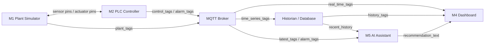
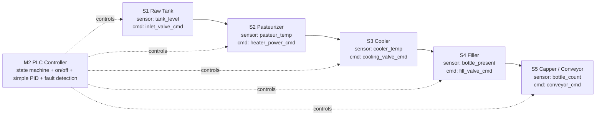

# Smart Beverage Pasteurization and Bottling Line Digital Twin

This repository contains a digital twin of a smart beverage pasteurization and bottling line. The system is organized like an RTL-style modular design: each module has clear input pins, output pins, and a defined responsibility.

> **TUMA206 group project.** A pure-Python implementation of the 5-module
> architecture below. The dashboard runs the whole line locally in one command
> and lets you inject faults live and see PLC alarms + AI operator advice.

## Quick start

```bash
# 1. Install Python 3.10+ (https://www.python.org/downloads/), then:
pip install -r requirements.txt

# 2. Launch the dashboard (this starts the simulator, PLC and data layer too):
streamlit run dashboard/app.py
```

Then in the browser: press **Start line**, watch the trends, and use the
**Fault injection** menu to trigger an alarm and see the AI recommendation.

No API key and no MQTT broker are required for the basic demo. To try the
Claude-powered assistant, copy `.env.example` to `.env` and set
`ANTHROPIC_API_KEY`. A terminal-only smoke test is available via `python run.py`.

## Technology stack (from the project proposal)

| Layer | Tool | Module |
|---|---|---|
| Frontend (dashboard) | Streamlit + Plotly | M4 |
| Backend | Python (FastAPI) + paho-mqtt | engine + M3 (FastAPI is optional) |
| Database | SQLite + CSV export | M3 historian |
| LLM model + provider | Claude Sonnet + Anthropic API | M5 |
| Agent framework | Claude Agent SDK / custom Python loop | M5 |

Everything is Python and installs with `pip`. React was considered but the team
chose Streamlit so no one has to learn a new frontend framework.

## 1. System Assumption

| Item | Value |
|---|---|
| System state update period | 1 s |

## 2. Top-Level Architecture



Key rule: the closed-loop control path is only between **M1 Plant Simulator** and **M2 PLC Controller**. The AI assistant recommends operator actions but does not directly control actuators.

## 3. Module Summary

| Module | Main input pins | Main output pins | Responsibility |
|---|---|---|---|
| M1 Plant Simulator | `actuator_cmd_*`, `fault_inject_code`, `reset_fault` | `sensor_*`, `feedback_*`, `stage_state`, `fault_status` | Simulate the physical beverage line and fault behavior. |
| M2 PLC Controller | `sensor_*`, `feedback_*`, `operator_start`, `operator_stop` | `actuator_cmd_*`, `alarm_code`, `plc_state` | Run control logic, state machine, and fault detection. |
| M3 Data Layer | `plant_tags`, `control_tags`, `alarm_tags` | `real_time_tags`, `history_tags`, `data_stale_flag` | Transfer tags through MQTT and store history in a historian/database. |
| M4 Dashboard | `real_time_tags`, `history_tags`, `recommendation_text` | `operator_start`, `operator_stop`, `fault_inject_code`, `reset_fault` | Display live status, trends, alarms, and fault-injection controls. |
| M5 AI Assistant | `latest_tags`, `alarm_code`, `recent_history` | `recommendation_text`, `diagnosis_label`, `confidence_level` | Explain alarms and recommend operator actions. |

## 4. M1 Plant Simulator Port Specification

```text
module M1_PlantSimulator (
    input  pump_cmd,
    input  inlet_valve_cmd,
    input  heater_power_cmd,
    input  cooling_valve_cmd,
    input  conveyor_cmd,
    input  fill_valve_cmd,
    input  capper_cmd,
    input  fault_inject_code,
    input  reset_fault,
    output tank_level,
    output pasteur_temp,
    output cooler_temp,
    output flow_rate,
    output bottle_present,
    output bottle_count,
    output pump_feedback,
    output valve_feedback,
    output stage_state,
    output fault_status
);
```

## 5. M2 PLC Controller Port Specification

```text
module M2_PLCController (
    input  tank_level,
    input  pasteur_temp,
    input  cooler_temp,
    input  flow_rate,
    input  bottle_present,
    input  pump_feedback,
    input  valve_feedback,
    input  operator_start,
    input  operator_stop,
    output pump_cmd,
    output inlet_valve_cmd,
    output heater_power_cmd,
    output cooling_valve_cmd,
    output conveyor_cmd,
    output fill_valve_cmd,
    output capper_cmd,
    output alarm_code,
    output plc_state
);
```

## 6. M3-M5 Port Specifications

### M3 Data Layer

```text
module M3_DataLayer (
    input  plant_tags,
    input  control_tags,
    input  alarm_tags,
    output real_time_tags,
    output history_tags,
    output data_stale_flag
);
```

### M4 Dashboard

```text
module M4_Dashboard (
    input  real_time_tags,
    input  history_tags,
    input  recommendation_text,
    output operator_start,
    output operator_stop,
    output fault_inject_code,
    output reset_fault
);
```

### M5 AI Assistant

```text
module M5_AIAssistant (
    input  latest_tags,
    input  alarm_code,
    input  recent_history,
    output recommendation_text,
    output diagnosis_label,
    output confidence_level
);
```

## 7. M1 and M2 Design

### 7.1 Pipeline



### 7.2 Stage Pin Definition

| Stage | M1 output sensor pins | M2 output command pins | Normal control meaning |
|---|---|---|---|
| S1 Raw Tank | `tank_level`, `flow_rate` | `inlet_valve_cmd`, `pump_cmd` | Low level opens inlet; high level closes inlet. |
| S2 Pasteurizer | `pasteur_temp`, `flow_rate` | `heater_power_cmd`, `pump_cmd` | Temperature below setpoint increases heater power. |
| S3 Cooler | `cooler_temp` | `cooling_valve_cmd` | High temperature opens cooling valve. |
| S4 Filler | `bottle_present`, `fill_level_est` | `fill_valve_cmd` | Bottle present opens filling valve for a fixed time. |
| S5 Capper / Conveyor | `bottle_count`, `capper_feedback` | `conveyor_cmd`, `capper_cmd` | Conveyor moves bottles and capper closes bottles. |

### 7.3 Fault Injection and Detection Pins

| Case | Fault injection pin | Observed abnormal pins | M2 alarm output |
|---|---|---|---|
| Normal | `fault_inject_code = 0` | Sensor and feedback pins follow commands. | `alarm_code = 0` |
| Sensor fault | `fault_inject_code = TEMP_STUCK` | `pasteur_temp` is frozen while `heater_power_cmd` changes. | `alarm_code = SENSOR_TEMP_STUCK` |
| Equipment fault | `fault_inject_code = PUMP_FAIL` | `pump_cmd = 1`, but `pump_feedback = 0` and `flow_rate = 0`. | `alarm_code = PUMP_NO_FLOW` |
| Process fault | `fault_inject_code = TEMP_EXCURSION` | `pasteur_temp` is outside safe range for multiple update cycles. | `alarm_code = TEMP_OUT_OF_RANGE` |
| Infrastructure fault | `fault_inject_code = MQTT_STALE` | `data_stale_flag = 1` or tag timestamp is too old. | `alarm_code = DATA_STALE` |

## 8. Repository Structure

```text
README.md            # this file (design spec + how to run)
config.py            # shared constants: tags, set-points, fault & alarm codes
simulator/plant.py   # M1  Plant Simulator (physics + fault behaviour)
plc/controller.py    # M2  PLC Controller (state machine, control, fault detection)
messaging/bus.py     # M3a Message bus (in-process or MQTT/paho-mqtt)
historian/store.py   # M3b Historian (SQLite storage + CSV export)
engine/runtime.py    #     Closed-loop runtime that wires M1+M2 and feeds M3
ai_assistant/assistant.py  # M5  AI Assistant (Claude API + rule-based fallback)
dashboard/app.py     # M4  Streamlit + Plotly dashboard (demo entry point)
backend/api.py       #     Optional FastAPI REST/WebSocket server (same engine)
run.py               #     Headless terminal demo / smoke test
requirements.txt
.env.example         # template for ANTHROPIC_API_KEY / USE_MQTT
```

### Suggested module ownership (6 members)

The first two modules are the most complex, so the chat agreed to put 3 people
on them. A suggested split:

| Member | Module / area |
|---|---|
| 1 | M1 Plant Simulator (`simulator/`) |
| 2 | M2 PLC Controller (`plc/`) |
| 3 | M1+M2 closed-loop engine + faults (`engine/`) |
| 4 | M3 Data Layer: MQTT bus + historian (`messaging/`, `historian/`) |
| 5 | M4 Dashboard (`dashboard/`) |
| 6 | M5 AI Assistant (`ai_assistant/`) |

## 9. Demo Plan

1. Run `streamlit run dashboard/app.py`. This starts the plant simulator (M1),
   PLC controller (M2), data layer / historian (M3) and AI assistant (M5)
   together, then opens the dashboard (M4).
2. Press **Start line** and let the line reach normal operation (tank level
   controlled, pasteurization temperature near 72 degC, bottles counting up).
3. Inject each fault from the **Fault injection** menu:
   - `1` Temperature sensor stuck -> `SENSOR_TEMP_STUCK`
   - `2` Feed pump failure -> `PUMP_NO_FLOW`
   - `3` Temperature excursion -> `TEMP_OUT_OF_RANGE`
   - `4` Data link stale (MQTT) -> `DATA_STALE`
4. Confirm the dashboard shows the alarm banner, the trend reacts, and the AI
   assistant explains the fault and recommends safe operator actions.
5. Press **Reset fault**, then **Start line** to recover, and **Export CSV** to
   save evidence of the run.

> Advanced: set `USE_MQTT=1` (with a Mosquitto broker on `localhost:1883`) to
> route tags over real MQTT, and run `uvicorn backend.api:app` to expose the
> same engine over REST/WebSocket.
